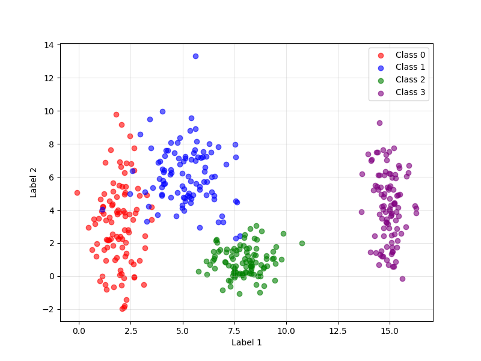
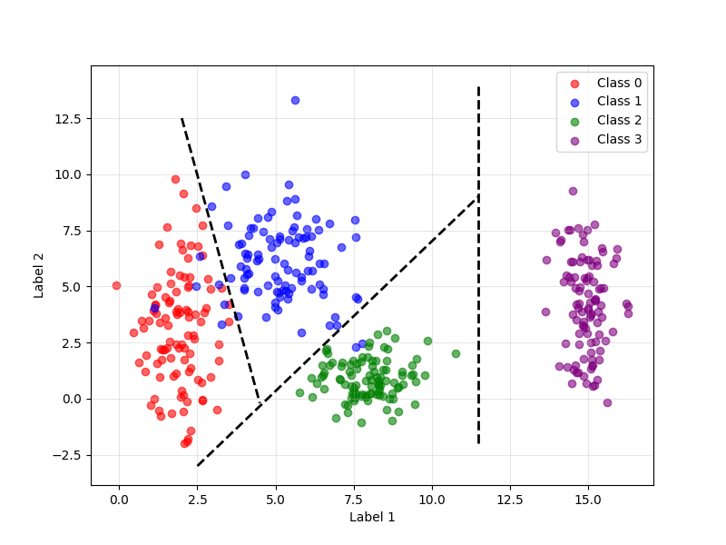

## 1. Generate the Data

``` py
params = {
        0: {MEAN: [2, 3], STD: [0.8,2.5]},
        1: {MEAN: [5, 6], STD: [1.2,1.9]},
        2: {MEAN: [8, 1], STD: [0.9,0.9]},
        3: {MEAN: [15, 4], STD: [0.5,2]},
        }
    
X = []
y = []

for cls, p in params.items():
    points = np.random.normal(loc=p["mean"], scale=p["std"], size=(100, 2))
    X.append(points)
    y.append(np.full(100, cls))

X = np.vstack(X)
y = np.hstack(y)
```

In this exercise, we are generating synthetic data for four distinct classes. Each class has its own mean and standard deviation, and we generate 100 points for each using a normal distribution. The arrays X and y store the features and the class labels, respectively.

## 2. Plot the data

``` py
colors = ['red', 'blue', 'green', 'purple']

plt.figure(figsize=(8, 6))
for cls in params.keys():
    plt.scatter(X[y == cls, 0], X[y == cls, 1], c=colors[cls], label=f"Class {cls}", alpha=0.6)

plt.xlabel("Label 1")
plt.ylabel("Label 2")
plt.legend()
plt.grid(True, alpha=0.3)

plt.savefig(os.path.join(IMAGES_OUTPUTS_FILE_PATH,'data','exercise1_2.png'))
```



Here, we visualize the data generated in the previous exercise. Each class is represented by a different color in a scatter plot, making it easier to visually analyze the distribution and separation between the groups. The plot is saved for later use.

## 3. Analyze and Draw Boundaries:

``` py
colors = ['red', 'blue', 'green', 'purple']

plt.figure(figsize=(8, 6))
for cls in params.keys():
    plt.scatter(X[y == cls, 0], X[y == cls, 1], c=colors[cls], label=f"Class {cls}", alpha=0.6)

plt.xlabel("Label 1")
plt.ylabel("Label 2")
plt.legend()
plt.grid(True, alpha=0.3)

plt.plot([2.5, 11.5], [-3, 9], color='black', linestyle='--', linewidth=2, label="Boundary 0-1")
plt.plot([2.0, 4.5], [12.5, -0.2], color='black', linestyle='--', linewidth=2, label="Boundary 1-2")
plt.plot([11.5, 11.5], [-2, 14], color='black', linestyle='--', linewidth=2, label="Boundary 2-3")

plt.savefig(os.path.join(IMAGES_OUTPUTS_FILE_PATH,'data','exercise1_3.png'))
```



Based on the code and the scatter plot, it is clear that each class is distributed around its mean, with dispersion defined by its standard deviation. Visually, the classes occupy distinct regions of the plane, but there is overlap between some of them, especially where the standard deviations are larger. Classes 0, 1, and 2 are closer together and may have mixed points at the edges, while class 3 is more distant.

Therefore, it is not possible to separate all four classes with just a single linear boundary. However, by using a greater number of lines, such as three, we achieve a division much closer to what is expected for neural network learning.

## Final Code:

``` py
def exercise1():
    params = {
        0: {MEAN: [2, 3], STD: [0.8,2.5]},
        1: {MEAN: [5, 6], STD: [1.2,1.9]},
        2: {MEAN: [8, 1], STD: [0.9,0.9]},
        3: {MEAN: [15, 4], STD: [0.5,2]},
        }
    
    X = []
    y = []

    for cls, p in params.items():
        points = np.random.normal(loc=p["mean"], scale=p["std"], size=(100, 2))
        X.append(points)
        y.append(np.full(100, cls))

    X = np.vstack(X)
    y = np.hstack(y)

    colors = ['red', 'blue', 'green', 'purple']

    plt.figure(figsize=(8, 6))
    for cls in params.keys():
        plt.scatter(X[y == cls, 0], X[y == cls, 1], c=colors[cls], label=f"Class {cls}", alpha=0.6)

    plt.xlabel("Label 1")
    plt.ylabel("Label 2")
    plt.legend()
    plt.grid(True, alpha=0.3)

    plt.savefig(os.path.join(IMAGES_OUTPUTS_FILE_PATH,'data','exercise1_2.png'))

    plt.plot([2.5, 11.5], [-3, 9], color='black', linestyle='--', linewidth=2, label="Boundary 0-1")
    plt.plot([2.0, 4.5], [12.5, -0.2], color='black', linestyle='--', linewidth=2, label="Boundary 1-2")
    plt.plot([11.5, 11.5], [-2, 14], color='black', linestyle='--', linewidth=2, label="Boundary 2-3")

    plt.savefig(os.path.join(IMAGES_OUTPUTS_FILE_PATH,'data','exercise1_3.png'))
```