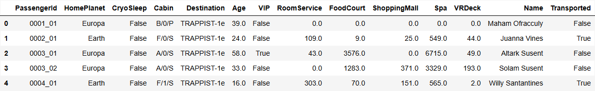
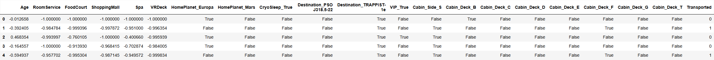
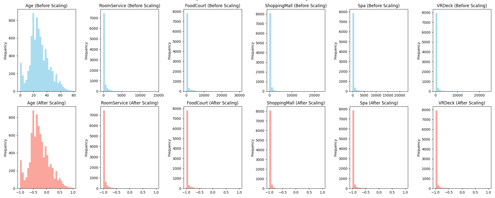

## Get the Data

Data downloaded from : Spaceship Titanic (https://www.kaggle.com/competitions/spaceship-titanic/data)



## Describe the Data

This documentation provides a comprehensive overview of the data preprocessing steps for a machine learning task, using the Spaceship Titanic dataset as a case study. The goal of preprocessing is to transform raw data into a clean, well-structured format that can be effectively used by machine learning models.

The objective of this training dataset is to predict whether a passenger was transported ("Transported") or not during a space voyage, based on various personal and consumption characteristics. 

We've categorized the features into three groups for clarity: numerical, categorical, and special columns.

``` py
numerical_features = ['Age', 'RoomService','FoodCourt','ShoppingMall', 'Spa', 'VRDeck']
categorical_features = ['HomePlanet','CryoSleep','Destination','VIP']
special_columns = ['Name', 'Cabin', 'PassengerId']
target_column = 'Transported'
```

``` py
df.info()
```
```
RangeIndex: 8693 entries, 0 to 8692
Data columns (total 14 columns):
 #   Column        Non-Null Count  Dtype
---  ------        --------------  -----
 0   PassengerId   8693 non-null   object
 1   HomePlanet    8492 non-null   object
 2   CryoSleep     8476 non-null   object
 3   Cabin         8494 non-null   object
 4   Destination   8511 non-null   object
 5   Age           8514 non-null   float64
 6   VIP           8490 non-null   object
 7   RoomService   8512 non-null   float64
 8   FoodCourt     8510 non-null   float64
 9   ShoppingMall  8485 non-null   float64
 10  Spa           8510 non-null   float64
 11  VRDeck        8505 non-null   float64
 12  Name          8493 non-null   object
 13  Transported   8693 non-null   bool
dtypes: bool(1), float64(6), object(7)
memory usage: 891.5+ KB
```
``` py
print(df.isnull().sum())
```
```
PassengerId       0
HomePlanet      201
CryoSleep       217
Cabin           199
Destination     182
Age             179
VIP             203
RoomService     181
FoodCourt       183
ShoppingMall    208
Spa             183
VRDeck          188
Name            200
Transported       0
dtype: int64
```

The df.info() and df.isnull().sum() outputs provide a critical initial look at the data, revealing column data types and the presence of missing values in nearly all features. This highlights the need for a robust preprocessing pipeline.

## Preprocess the Data

**Handling Special Columns**

- **Name and PassengerId**: These are unique identifiers that have no predictive power for the model. We drop them to prevent the model from memorizing individual records, which would lead to overfitting.

- **Cabin**: The cabin feature is structured as Deck/Num/Side. The Deck and Side (P for Port, S for Starboard) likely hold valuable information about the passenger's location, which could influence their outcome. The Num is a unique identifier, similar to a name or ID, and is not useful for prediction, so we can ignore it. We use a regular expression to extract the Deck and Side into two new categorical columns before dropping the original Cabin column.

``` py
df.drop(columns=['Name', 'PassengerId'], inplace=True)
df[['Cabin_Deck', 'Cabin_Side']] = df['Cabin'].str.extract(r'([A-Z]+)\/\d+\/([A-Z]+)')
df.drop(columns=['Cabin'], inplace=True)

categorical_features.append('Cabin_Side')
categorical_features.append('Cabin_Deck')
```

**Imputing Missing Values**

- **Numerical Features**: Missing values in numerical columns (Age, RoomService, etc.) are filled with the median. The median is used instead of the mean because it is less sensitive to outliers, ensuring that a few extreme values do not distort the central tendency of the data.

- **Categorical Features**: Missing values in categorical columns are filled with the mode (the most frequent value). This is a simple and effective strategy that preserves the original distribution of each category.

``` py
for col in numerical_features:
        df[col] = df[col].fillna(df[col].median())
for col in categorical_features:
    df[col] = df[col].fillna(df[col].mode()[0])
```

**Feature Engineering and Scaling**

- **Encoding Categorical Features**: Machine learning algorithms require numerical input. We use One-Hot Encoding to convert categorical features (HomePlanet, Cabin_Deck, etc.) into a binary format. This creates a new column for each category, with a value of 1 for the relevant category and 0 otherwise. The drop_first=True argument prevents multicollinearity by dropping one of the generated columns.

- **Scaling Numerical Features**: Features with different ranges can bias a model. We use Min-Max Scaling to transform all numerical features to a common range of [-1, 1]. This ensures that each feature contributes equally to the model, preventing features with large values from dominating the learning process.

``` py
df_encoded = pd.get_dummies(df[categorical_features], drop_first=True)
```

``` py
scaler = MinMaxScaler(feature_range=(-1, 1))
df_scaled = pd.DataFrame(scaler.fit_transform(df[numerical_features]), columns=numerical_features)
```

**Final Data Assembly**

The final step is to combine the scaled numerical features, the one-hot encoded categorical features, and the target variable (Transported) into a single processed DataFrame ready for model training.

``` py
df_processed = pd.concat([df_scaled, df_encoded], axis=1)
df_processed[target_column] = df[target_column].astype(int) 
```



## Visualize the Results

Histograms are used to visualize the distribution of numerical features before and after scaling. The plots clearly demonstrate the effect of Min-Max Scaling, which normalizes the data to the [-1, 1] range, aligning all features on a consistent scale. This visual confirmation is crucial for validating that the preprocessing steps were performed correctly.

The histograms show how the distributions of features like Age and RoomService are transformed from their original ranges to the [-1, 1] range. This normalization helps to ensure that each feature contributes equally to the model training process, improving convergence speed and overall model performance.

``` py
fig, axes = plt.subplots(2, len(numerical_features), figsize=(20, 8))
for i, col in enumerate(numerical_features):
    df[col].plot.hist(bins=30, ax=axes[0, i], alpha=0.7, color='skyblue')
    axes[0, i].set_title(f"{col} (Before Scaling)")
    df_scaled[col].plot.hist(bins=30, ax=axes[1, i], alpha=0.7, color='salmon')
    axes[1, i].set_title(f"{col} (After Scaling)")

plt.tight_layout()
plt.suptitle("Histograms of Numerical Features (Before and After Scaling)", y=1.02)
plt.savefig(os.path.join(IMAGES_OUTPUTS_FILE_PATH,'data','exercise3_4.png'))
plt.close()
```



## Final Code: Integrated Solution

Here is the complete code for loading, preprocessing, and visualizing the dataset:

``` py
def exercise3():
    df = pd.read_csv(os.path.join(DATA_OUTPUTS_FILE_PATH,'data','spaceship_titanic','train.csv'))
    df_head = df.head(5)

    numerical_features = ['Age', 'RoomService','FoodCourt','ShoppingMall', 'Spa', 'VRDeck']
    categorical_features = ['HomePlanet','CryoSleep','Destination','VIP']
    special_columns = ['Name', 'Cabin', 'PassengerId']
    target_column = 'Transported'

    df.info()
    print(df.isnull().sum())

    df.drop(columns=['Name', 'PassengerId'], inplace=True)
    df[['Cabin_Deck', 'Cabin_Side']] = df['Cabin'].str.extract(r'([A-Z]+)\/\d+\/([A-Z]+)')
    df.drop(columns=['Cabin'], inplace=True)

    categorical_features.append('Cabin_Side')
    categorical_features.append('Cabin_Deck')

    for col in numerical_features:
        df[col] = df[col].fillna(df[col].median())
    for col in categorical_features:
        df[col] = df[col].fillna(df[col].mode()[0])

    df_encoded = pd.get_dummies(df[categorical_features], drop_first=True)

    scaler = MinMaxScaler(feature_range=(-1, 1))
    df_scaled = pd.DataFrame(scaler.fit_transform(df[numerical_features]), columns=numerical_features)

    df_processed = pd.concat([df_scaled, df_encoded], axis=1)
    df_processed[target_column] = df[target_column].astype(int) 
    
    df_processed_head = df_processed.head(5)

    fig, axes = plt.subplots(2, len(numerical_features), figsize=(20, 8))
    for i, col in enumerate(numerical_features):
        df[col].plot.hist(bins=30, ax=axes[0, i], alpha=0.7, color='skyblue')
        axes[0, i].set_title(f"{col} (Before Scaling)")
        df_scaled[col].plot.hist(bins=30, ax=axes[1, i], alpha=0.7, color='salmon')
        axes[1, i].set_title(f"{col} (After Scaling)")

    plt.tight_layout()
    plt.suptitle("Histograms of Numerical Features (Before and After Scaling)", y=1.02)
    plt.savefig(os.path.join(IMAGES_OUTPUTS_FILE_PATH,'data','exercise3_4.png'))
    plt.close()
```