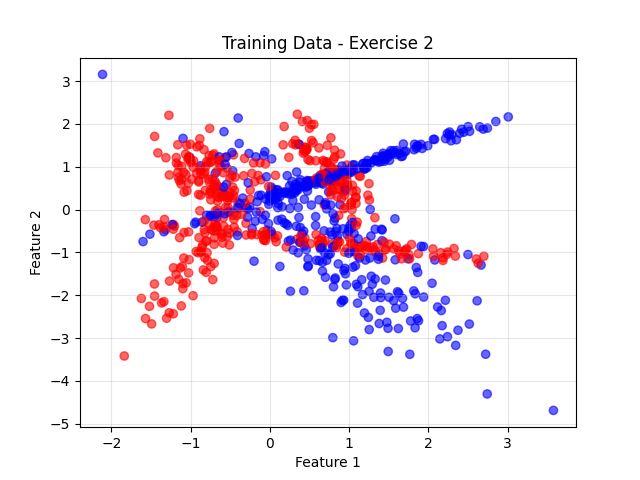
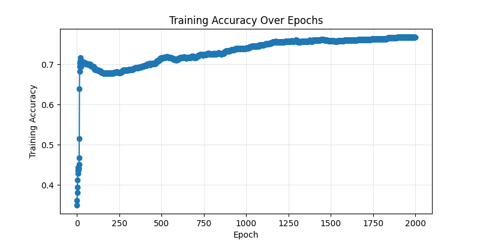
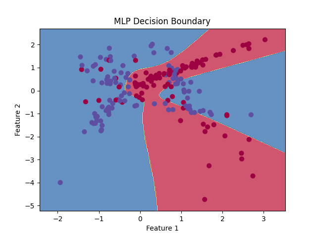

# Binary Classification with MLP from Scratch

## Data Generation

```python
X_train, X_test, y_train, y_test = generate_binary_data()
```

## Data Visualization

```python
plt.scatter(X_train[:,0], X_train[:,1], c=y_train.flatten(), cmap='bwr', alpha=0.6)
plt.title('Training Data - Exercise 2')
plt.xlabel('Feature 1')
plt.ylabel('Feature 2')
plt.grid(True, alpha=0.3)
plt.savefig(os.path.join(IMAGES_OUTPUTS_FILE_PATH,'mlp','exercise2_data.png'))
plt.close()
```



## Model Initialization

```python
input_size = X_train.shape[1]
hidden_sizes = [16]
output_size = 1
learning_rate = 0.05
mlp = MLP(input_size, hidden_sizes, output_size, learning_rate, task='binary')
```

## Training and Accuracy per Epoch

```python
train_accuracies = []
epochs = 2000
for epoch in range(epochs):
    mlp.train(X_train, y_train, 1)
    y_train_pred = mlp.forward(X_train)
    y_train_pred_classes = (y_train_pred > 0.5).astype(int)
    acc = accuracy_score(y_train, y_train_pred_classes)
    train_accuracies.append(acc)
    if (epoch+1) % 100 == 0:
        print(f"Epoch {epoch+1}/{epochs}, Training Accuracy: {acc*100:.2f}%")
```

## Test Evaluation

```python
y_test_pred = mlp.forward(X_test)
y_test_pred_classes = (y_test_pred > 0.5).astype(int)
accuracy = accuracy_score(y_test, y_test_pred_classes)
print(f"Test Accuracy: {accuracy * 100:.2f}%")
```

**Test Accuracy: 82.50%**

## Training Accuracy Plot

```python
plt.figure(figsize=(8,4))
plt.plot(train_accuracies, marker='o')
plt.xlabel('Epoch')
plt.ylabel('Training Accuracy')
plt.title('Training Accuracy Over Epochs')
plt.grid(True, alpha=0.3)
plt.savefig(os.path.join(IMAGES_OUTPUTS_FILE_PATH,'mlp','exercise2_accuracy.png'))
plt.close()
```



## Decision Boundary

```python
if input_size == 2:
    plot_decision_boundary(mlp, X_test, y_test, 'exercise2_decision_boundary.png')
```


