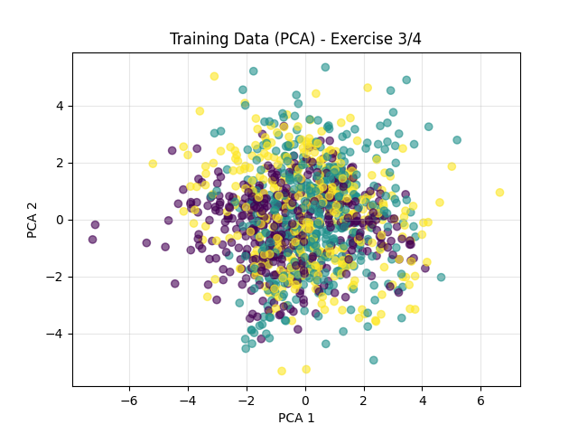
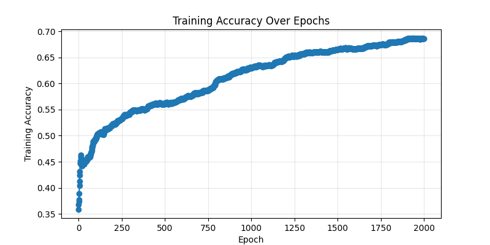
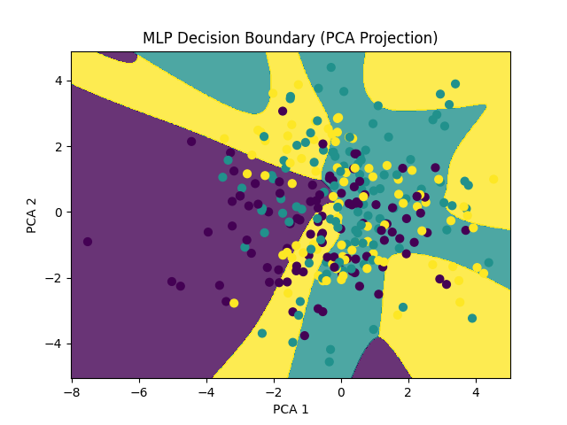
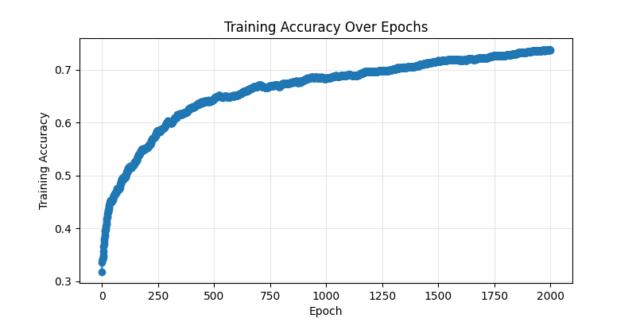
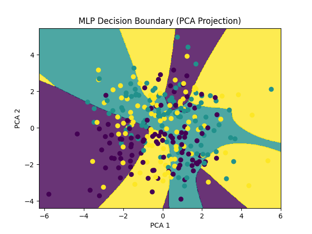

# Multi-Class Classification with MLP from Scratch

## Data Generation

```python
def generate_multiclass_data():
    """Gera dados para os Exercícios 3 e 4 (classificação multi-classe)."""
    n_samples = 1500
    n_features = 4
    random_state = 42

    # Classe 0: 2 clusters
    X0, y0 = make_classification(n_samples=int(n_samples/3), n_features=n_features, n_informative=n_features,
                                 n_redundant=0, n_clusters_per_class=2, flip_y=0.01,
                                 class_sep=1.0, random_state=random_state)
    y0[:] = 0

    # Classe 1: 3 clusters
    X1, y1 = make_classification(n_samples=int(n_samples/3), n_features=n_features, n_informative=n_features,
                                 n_redundant=0, n_clusters_per_class=3, flip_y=0.01,
                                 class_sep=1.0, random_state=random_state + 1)
    y1[:] = 1

    # Classe 2: 4 clusters
    X2, y2 = make_classification(n_samples=int(n_samples/3), n_features=n_features, n_informative=n_features,
                                 n_redundant=0, n_clusters_per_class=4, flip_y=0.01,
                                 class_sep=1.0, random_state=random_state + 2)
    y2[:] = 2

    # Combina e embaralha os dados
    X = np.vstack((X0, X1, X2))
    y = np.hstack((y0, y1, y2))
    
    shuffle_indices = np.random.permutation(n_samples)
    X = X[shuffle_indices]
    y = y[shuffle_indices]

    # Converte y para one-hot encoding
    y_one_hot = np.eye(3)[y]
    X_train, X_test, y_train, y_test = train_test_split(X, y_one_hot, test_size=0.2, random_state=random_state)
    
    # Armazena os rótulos originais para avaliação de acurácia
    y_test_labels = np.argmax(y_test, axis=1)

    return X_train, X_test, y_train, y_test, y_test_labels


X_train, X_test, y_train, y_test, y_test_labels = generate_multiclass_data()
```

## Data Visualization (PCA)

```python
from sklearn.decomposition import PCA
pca = PCA(n_components=2)
X_train_2d = pca.fit_transform(X_train)
plt.scatter(X_train_2d[:,0], X_train_2d[:,1], c=np.argmax(y_train, axis=1), cmap='viridis', alpha=0.6)
plt.title('Training Data (PCA) - Exercise 3/4')
plt.xlabel('PCA 1')
plt.ylabel('PCA 2')
plt.grid(True, alpha=0.3)
plt.savefig(os.path.join(IMAGES_OUTPUTS_FILE_PATH,'mlp','exercise3_data_pca.png'))
plt.close()
```



## Exercise 3: MLP with 1 Hidden Layer

### Model Initialization

```python
input_size = X_train.shape[1]
hidden_sizes = [64]
output_size = 3
learning_rate = 0.05
mlp = MLP(input_size, hidden_sizes, output_size, learning_rate, task='multiclass')
```

### Training and Accuracy per Epoch

```python
train_accuracies = []
epochs = 2000
for epoch in range(epochs):
    mlp.train(X_train, y_train, 1)
    y_train_pred = mlp.forward(X_train)
    y_train_pred_labels = np.argmax(y_train_pred, axis=1)
    y_train_labels = np.argmax(y_train, axis=1)
    acc = accuracy_score(y_train_labels, y_train_pred_labels)
    train_accuracies.append(acc)
    if (epoch+1) % 100 == 0:
        print(f"Epoch {epoch+1}/{epochs}, Training Accuracy: {acc*100:.2f}%")
```

### Test Evaluation

```python
y_test_pred = mlp.forward(X_test)
y_test_pred_labels = np.argmax(y_test_pred, axis=1)
accuracy = accuracy_score(y_test_labels, y_test_pred_labels)
print(f"Test Accuracy (Exercise 3): {accuracy * 100:.2f}%")
```

**Test Accuracy (Exercise 3): 62.00%**

### Training Accuracy Plot

```python
plt.figure(figsize=(8,4))
plt.plot(train_accuracies, marker='o')
plt.xlabel('Epoch')
plt.ylabel('Training Accuracy')
plt.title('Training Accuracy Over Epochs')
plt.grid(True, alpha=0.3)
plt.savefig(os.path.join(IMAGES_OUTPUTS_FILE_PATH,'mlp','exercise3_accuracy.png'))
plt.close()
```



### Decision Boundary (PCA)

```python
plot_decision_boundary_pca(mlp, X_test, y_test, pca, 'exercise3_decision_boundary_pca.png')
```



---

## Exercise 4: MLP with 2 Hidden Layers

### Model Initialization

```python
input_size = X_train.shape[1]
hidden_sizes = [64, 32]
output_size = 3
learning_rate = 0.05
mlp = MLP(input_size, hidden_sizes, output_size, learning_rate, task='multiclass')
```

### Training and Accuracy per Epoch

```python
train_accuracies = []
epochs = 2000
for epoch in range(epochs):
    mlp.train(X_train, y_train, 1)
    y_train_pred = mlp.forward(X_train)
    y_train_pred_labels = np.argmax(y_train_pred, axis=1)
    y_train_labels = np.argmax(y_train, axis=1)
    acc = accuracy_score(y_train_labels, y_train_pred_labels)
    train_accuracies.append(acc)
    if (epoch+1) % 100 == 0:
        print(f"Epoch {epoch+1}/{epochs}, Training Accuracy: {acc*100:.2f}%")
```

### Test Evaluation

```python
y_test_pred = mlp.forward(X_test)
y_test_pred_labels = np.argmax(y_test_pred, axis=1)
accuracy = accuracy_score(y_test_labels, y_test_pred_labels)
print(f"Test Accuracy (Exercise 4): {accuracy * 100:.2f}%")
```

**Test Accuracy (Exercise 4): 68.67%**

### Training Accuracy Plot

```python
plt.figure(figsize=(8,4))
plt.plot(train_accuracies, marker='o')
plt.xlabel('Epoch')
plt.ylabel('Training Accuracy')
plt.title('Training Accuracy Over Epochs')
plt.grid(True, alpha=0.3)
plt.savefig(os.path.join(IMAGES_OUTPUTS_FILE_PATH,'mlp','exercise4_accuracy.png'))
plt.close()
```



### Decision Boundary (PCA)

```python
plot_decision_boundary_pca(mlp, X_test, y_test, pca, 'exercise4_decision_boundary_pca.png')
```


