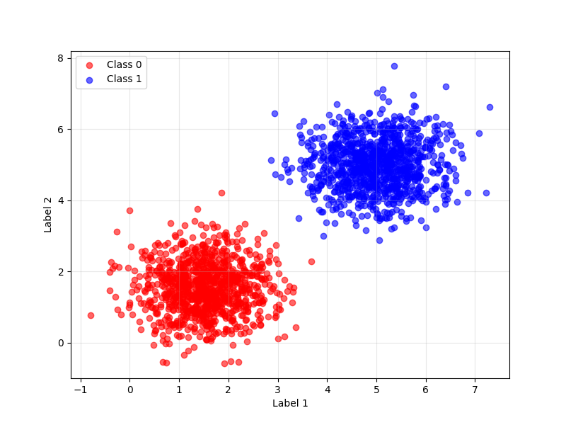
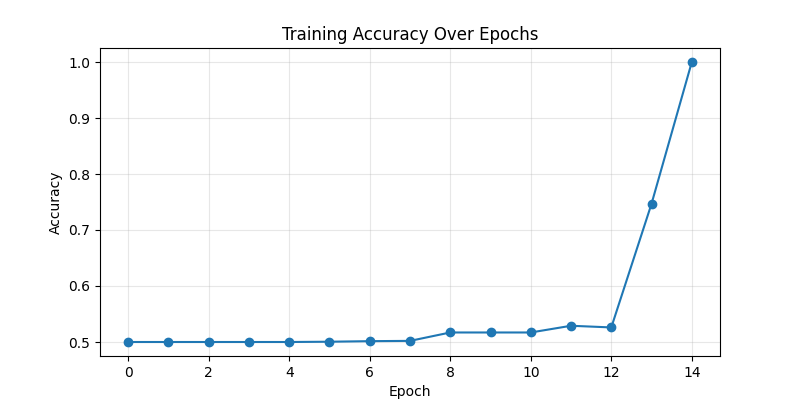
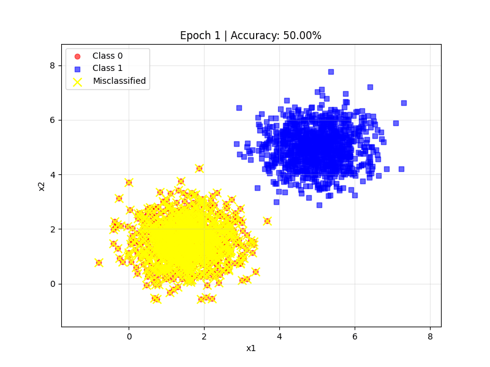
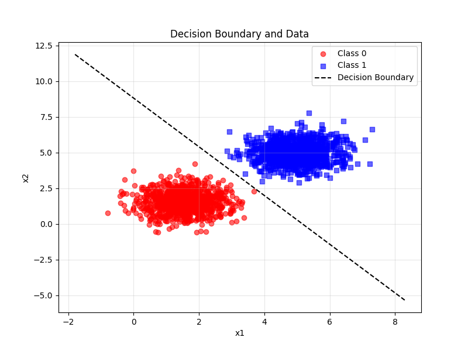

## Data generation and visualization

``` py
PARAMS_EX1 = {
        0 : {
            MEAN : [1.5, 1.5], 
            STD : [[0.5, 0], [0, 0.5]]
        },
        1 : {
            MEAN : [5, 5], 
            STD : [[0.5, 0], [0, 0.5]]
        }
    }

def generate_data(params, n_samples = 1000):
    X = []
    y = []

    cls_A = np.random.multivariate_normal(params[0][MEAN], params[0][STD], n_samples)
    cls_B = np.random.multivariate_normal(params[1][MEAN], params[1][STD], n_samples)
    labels_A = np.zeros(n_samples)
    labels_B = np.ones(n_samples)

    X = np.vstack((cls_A, cls_B))
    y = np.hstack((labels_A, labels_B))

    return X, y

def save_plot_data(X, y, params, img_name):
    colors = ['red', 'blue']

    plt.figure(figsize=(8, 6))
    for cls in params.keys():
        plt.scatter(X[y == cls, 0], X[y == cls, 1], c=colors[cls], label=f"Class {cls}", alpha=0.6)

    plt.xlabel("Label 1")
    plt.ylabel("Label 2")
    plt.legend()
    plt.grid(True, alpha=0.3)
    plt.savefig(os.path.join(IMAGES_OUTPUTS_FILE_PATH,'perceptron',img_name))  
```

This code generates a synthetic 2D dataset for a binary classification task. We'll create two distinct classes, each with 1,000 data points, using multivariate normal distributions. This is a common practice in machine learning to create controlled datasets for testing algorithms.

The key parameters for each class are its mean (the center of the data cluster) and its covariance matrix (which defines the spread and orientation of the data points). In this case, the low variance of 0.5 along each dimension and a large distance between the class means ([1.5, 1.5] vs. [5, 5]) ensure that the two classes form tight, well-separated clusters. This configuration results in a dataset that is linearly separable—meaning a single straight line can perfectly divide the two classes.



## Perceptron Implementation

``` py
class Perceptron:
    def __init__(self, tag, w=np.zeros(2), b=1, learning_rate=0.01, max_epochs=100):
        self.tag = tag
        self.max_epochs = max_epochs
        self.learning_rate = learning_rate
        self.w = w
        self.b = b
        self.training_accuracies = []
        self.predict_function = lambda x: np.dot(self.w, x) + self.b
        self.activation_function = lambda z: 1 if z >= 0 else 0 
    
    def classify(self, x):
        z = self.predict_function(x)
        return self.activation_function(z)
    
    def train_epoch(self, cls, labels):
        weights_updated = False
        errors_count = 0
        
        for x, label in zip(cls, labels):
            x = np.array(x)
            result = self.classify(x)
            
            error = label - result
            
            if error != 0:
                self.w += self.learning_rate * error * x
                self.b += self.learning_rate * error
                weights_updated = True
                errors_count += 1
        print(f"Erros na época: {errors_count}")
        return weights_updated

    def train(self, cls, labels):
        weights_updated = True
        current_epoch = 1
        accuracy_list = [self.evaluate(cls, labels)]
        weights_history = [self.w.copy()]
        bias_history = [self.b]
        X = np.array(cls)
        y = np.array(labels)
        while weights_updated and current_epoch <= self.max_epochs:
            weights_updated = self.train_epoch(cls, labels)
            acc = self.evaluate(cls, labels)
            accuracy_list.append(acc)
            weights_history.append(self.w.copy())
            bias_history.append(self.b)
            current_epoch += 1
        print(f"Training finished at epoch {current_epoch-1}")
        accuracy_list = accuracy_list[:-1]
        weights_history = weights_history[:-1]
        bias_history = bias_history[:-1]
        self.plot_accuracy(accuracy_list)
        self.plot_decision_boundary(X, y)
        self.animate_training(X, y, accuracy_list, weights_history, bias_history)

    def evaluate(self, cls, labels, verbose=True):
        correct = 0
        for x, label in zip(cls, labels):
            result = self.classify(x)
            if result == label:
                correct += 1
        accuracy = correct / len(labels)
        if verbose:
            print(f"Acurácia: {accuracy*100:.2f}%")
        return accuracy

    def plot_decision_boundary(self, X, y):
        plt.figure(figsize=(8,6))
        for label, marker, color in zip([0,1], ['o','s'], ['red','blue']):
            plt.scatter(X[y==label,0], X[y==label,1], marker=marker, color=color, label=f"Class {label}", alpha=0.6)
        x_vals = np.linspace(X[:,0].min()-1, X[:,0].max()+1, 100)
        if self.w[1] != 0:
            y_vals = -(self.w[0]*x_vals + self.b)/self.w[1]
            plt.plot(x_vals, y_vals, 'k--', label='Decision Boundary')
        plt.xlabel('x1')
        plt.ylabel('x2')
        plt.legend()
        plt.title('Decision Boundary and Data')
        plt.grid(True, alpha=0.3)
        plt.savefig(os.path.join(IMAGES_OUTPUTS_FILE_PATH, 'perceptron', f'decision_boundary_{self.tag}.png'))

    def plot_accuracy(self, accuracy_list):
        plt.figure(figsize=(8,4))
        plt.plot(accuracy_list, marker='o')
        plt.xlabel('Epoch')
        plt.ylabel('Accuracy')
        plt.title('Training Accuracy Over Epochs')
        plt.grid(True, alpha=0.3)
        plt.savefig(os.path.join(IMAGES_OUTPUTS_FILE_PATH, 'perceptron', f'accuracy_{self.tag}.png'))

    def animate_training(self, X, y, accuracy_list, weights_history, bias_history):
        fig, ax = plt.subplots(figsize=(8,6))
        xlim = (X[:,0].min()-1, X[:,0].max()+1)
        ylim = (X[:,1].min()-1, X[:,1].max()+1)
        def update(epoch):
            ax.clear()
            for label, marker, color in zip([0,1], ['o','s'], ['red','blue']):
                ax.scatter(X[y==label,0], X[y==label,1], marker=marker, color=color, label=f"Class {label}", alpha=0.6)
            w = weights_history[epoch]
            b = bias_history[epoch]
            if w[1] != 0:
                x_vals = np.linspace(xlim[0], xlim[1], 100)
                y_vals = -(w[0]*x_vals + b)/w[1]
                ax.plot(x_vals, y_vals, 'k--', label='Decision Boundary')
            misclassified = []
            for i, (x_point, label_point) in enumerate(zip(X, y)):
                pred = 1 if np.dot(w, x_point) + b >= 0 else 0
                if pred != label_point:
                    misclassified.append(i)
            if misclassified:
                ax.scatter(X[misclassified,0], X[misclassified,1], c='yellow', marker='x', s=100, label='Misclassified')
            ax.set_title(f'Epoch {epoch+1} | Accuracy: {accuracy_list[epoch]*100:.2f}%')
            ax.set_xlabel('x1')
            ax.set_ylabel('x2')
            ax.set_xlim(xlim)
            ax.set_ylim(ylim)
            ax.legend()
            ax.grid(True, alpha=0.3)
        anim = FuncAnimation(fig, update, frames=len(weights_history), interval=1500)
        anim_path = os.path.join(GIFS_OUTPUTS_FILE_PATH, 'perceptron', f'animate_training_{self.tag}.gif')
        anim.save(anim_path, writer=PillowWriter(fps=2))
        plt.close()
```

### Accuracy during training





### Decision Boundary



On the linearly separable dataset, the perceptron achieved 100.00% accuracy, demonstrating perfect classification. The model converged very quickly, finishing training in just 15 epochs with final weights of w = [0.02128936, 0.0124718] and a bias of b = -0.11.

The rapid convergence to a perfect solution is a direct consequence of the Perceptron Convergence Theorem. This theorem guarantees that if a dataset is linearly separable—meaning a single straight line can perfectly divide the classes—the perceptron algorithm is guaranteed to find that separating line in a finite number of steps.

In our specific case, the data was not only linearly separable but also had:

Large Distance Between Means: The clusters were far apart.

Low Variance: The data points within each cluster were tightly packed.

These characteristics make the classification task trivial for the perceptron. With each weight update, the model's decision boundary moves closer to the ideal separation line. Since there is no overlap, the algorithm efficiently finds a valid solution without having to "oscillate" or make compromises to correct misclassified points from different classes. The low number of epochs confirms that a clear and simple solution was found very quickly.

## Final Code:

The complete code for the perceptron implementation and training process can be found below:

``` py
import numpy as np
import matplotlib.pyplot as plt
from matplotlib.animation import FuncAnimation, PillowWriter
from src.utils import *
import os

class Perceptron:
    def __init__(self, tag, w=np.zeros(2), b=1, learning_rate=0.01, max_epochs=100):
        self.tag = tag
        self.max_epochs = max_epochs
        self.learning_rate = learning_rate
        self.w = w
        self.b = b
        self.training_accuracies = []
        self.predict_function = lambda x: np.dot(self.w, x) + self.b
        self.activation_function = lambda z: 1 if z >= 0 else 0 
    
    def classify(self, x):
        z = self.predict_function(x)
        return self.activation_function(z)
    
    def train_epoch(self, cls, labels):
        weights_updated = False
        errors_count = 0
        
        for x, label in zip(cls, labels):
            x = np.array(x)
            result = self.classify(x)
            
            error = label - result
            
            if error != 0:
                self.w += self.learning_rate * error * x
                self.b += self.learning_rate * error
                weights_updated = True
                errors_count += 1
        print(f"Erros na época: {errors_count}")
        return weights_updated

    def train(self, cls, labels):
        weights_updated = True
        current_epoch = 1
        accuracy_list = [self.evaluate(cls, labels)]
        weights_history = [self.w.copy()]
        bias_history = [self.b]
        X = np.array(cls)
        y = np.array(labels)
        while weights_updated and current_epoch <= self.max_epochs:
            weights_updated = self.train_epoch(cls, labels)
            acc = self.evaluate(cls, labels)
            accuracy_list.append(acc)
            weights_history.append(self.w.copy())
            bias_history.append(self.b)
            current_epoch += 1
        print(f"Training finished at epoch {current_epoch-1}")
        accuracy_list = accuracy_list[:-1]
        weights_history = weights_history[:-1]
        bias_history = bias_history[:-1]
        self.plot_accuracy(accuracy_list)
        self.plot_decision_boundary(X, y)
        self.animate_training(X, y, accuracy_list, weights_history, bias_history)

    def evaluate(self, cls, labels, verbose=True):
        correct = 0
        for x, label in zip(cls, labels):
            result = self.classify(x)
            if result == label:
                correct += 1
        accuracy = correct / len(labels)
        if verbose:
            print(f"Acurácia: {accuracy*100:.2f}%")
        return accuracy

    def plot_decision_boundary(self, X, y):
        plt.figure(figsize=(8,6))
        for label, marker, color in zip([0,1], ['o','s'], ['red','blue']):
            plt.scatter(X[y==label,0], X[y==label,1], marker=marker, color=color, label=f"Class {label}", alpha=0.6)
        x_vals = np.linspace(X[:,0].min()-1, X[:,0].max()+1, 100)
        if self.w[1] != 0:
            y_vals = -(self.w[0]*x_vals + self.b)/self.w[1]
            plt.plot(x_vals, y_vals, 'k--', label='Decision Boundary')
        plt.xlabel('x1')
        plt.ylabel('x2')
        plt.legend()
        plt.title('Decision Boundary and Data')
        plt.grid(True, alpha=0.3)
        plt.savefig(os.path.join(IMAGES_OUTPUTS_FILE_PATH, 'perceptron', f'decision_boundary_{self.tag}.png'))

    def plot_accuracy(self, accuracy_list):
        plt.figure(figsize=(8,4))
        plt.plot(accuracy_list, marker='o')
        plt.xlabel('Epoch')
        plt.ylabel('Accuracy')
        plt.title('Training Accuracy Over Epochs')
        plt.grid(True, alpha=0.3)
        plt.savefig(os.path.join(IMAGES_OUTPUTS_FILE_PATH, 'perceptron', f'accuracy_{self.tag}.png'))

    def animate_training(self, X, y, accuracy_list, weights_history, bias_history):
        fig, ax = plt.subplots(figsize=(8,6))
        xlim = (X[:,0].min()-1, X[:,0].max()+1)
        ylim = (X[:,1].min()-1, X[:,1].max()+1)
        def update(epoch):
            ax.clear()
            for label, marker, color in zip([0,1], ['o','s'], ['red','blue']):
                ax.scatter(X[y==label,0], X[y==label,1], marker=marker, color=color, label=f"Class {label}", alpha=0.6)
            w = weights_history[epoch]
            b = bias_history[epoch]
            if w[1] != 0:
                x_vals = np.linspace(xlim[0], xlim[1], 100)
                y_vals = -(w[0]*x_vals + b)/w[1]
                ax.plot(x_vals, y_vals, 'k--', label='Decision Boundary')
            misclassified = []
            for i, (x_point, label_point) in enumerate(zip(X, y)):
                pred = 1 if np.dot(w, x_point) + b >= 0 else 0
                if pred != label_point:
                    misclassified.append(i)
            if misclassified:
                ax.scatter(X[misclassified,0], X[misclassified,1], c='yellow', marker='x', s=100, label='Misclassified')
            ax.set_title(f'Epoch {epoch+1} | Accuracy: {accuracy_list[epoch]*100:.2f}%')
            ax.set_xlabel('x1')
            ax.set_ylabel('x2')
            ax.set_xlim(xlim)
            ax.set_ylim(ylim)
            ax.legend()
            ax.grid(True, alpha=0.3)
        anim = FuncAnimation(fig, update, frames=len(weights_history), interval=1500)
        anim_path = os.path.join(GIFS_OUTPUTS_FILE_PATH, 'perceptron', f'animate_training_{self.tag}.gif')
        anim.save(anim_path, writer=PillowWriter(fps=2))
        plt.close()

import numpy as np
from src.utils import *
import matplotlib.pyplot as plt
from src.perceptron.perceptron import Perceptron

PARAMS_EX1 = {
        0 : {
            MEAN : [1.5, 1.5], 
            STD : [[0.5, 0], [0, 0.5]]
        },
        1 : {
            MEAN : [5, 5], 
            STD : [[0.5, 0], [0, 0.5]]
        }
    }

def generate_data(params, n_samples = 1000):
    X = []
    y = []

    cls_A = np.random.multivariate_normal(params[0][MEAN], params[0][STD], n_samples)
    cls_B = np.random.multivariate_normal(params[1][MEAN], params[1][STD], n_samples)
    labels_A = np.zeros(n_samples)
    labels_B = np.ones(n_samples)

    X = np.vstack((cls_A, cls_B))
    y = np.hstack((labels_A, labels_B))

    return X, y

def save_plot_data(X, y, params, img_name):
    colors = ['red', 'blue']

    plt.figure(figsize=(8, 6))
    for cls in params.keys():
        plt.scatter(X[y == cls, 0], X[y == cls, 1], c=colors[cls], label=f"Class {cls}", alpha=0.6)

    plt.xlabel("Label 1")
    plt.ylabel("Label 2")
    plt.legend()
    plt.grid(True, alpha=0.3)
    plt.savefig(os.path.join(IMAGES_OUTPUTS_FILE_PATH,'perceptron',img_name))  

def exercise1():
    X, y  = generate_data(params=PARAMS_EX1, n_samples=1000)
    save_plot_data(X, y, PARAMS_EX1,'exercise1_1.png')
    perceptron = Perceptron('ex1')
    perceptron.train(X, y)
    print(f'Final training weights: {perceptron.w}, and Bias: {perceptron.b}')

def main():
    exercise1()

if __name__ == "__main__":
    np.random.seed(42)
    main()
```