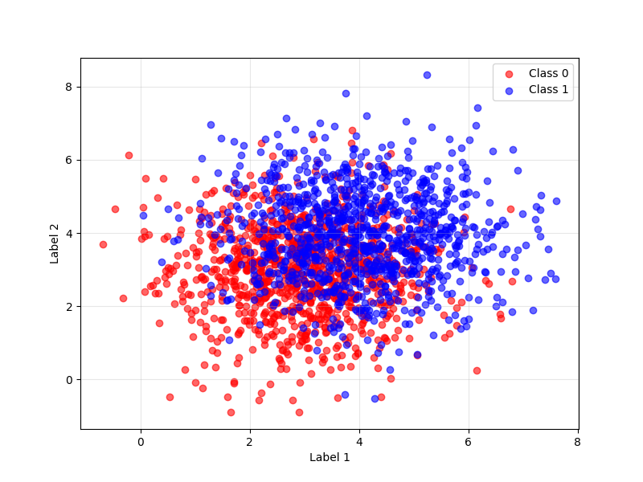
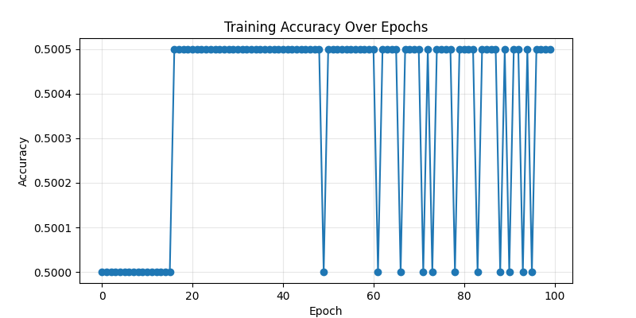
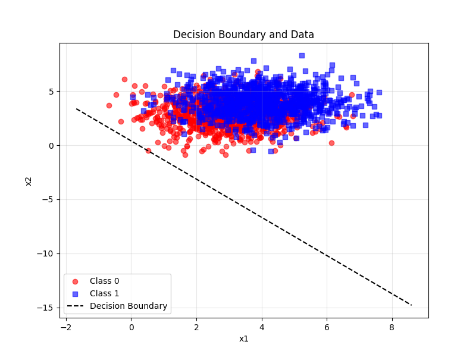

## Data generation and visualization

``` py
PARAMS_EX2 = {
        0 : {
            MEAN : [3, 3], 
            STD : [[1.5, 0], [0, 1.5]]
        },
        1 : {
            MEAN : [4, 4], 
            STD : [[1.5, 0], [0, 1.5]]
        }
    }

def generate_data(params, n_samples = 1000):
    X = []
    y = []

    cls_A = np.random.multivariate_normal(params[0][MEAN], params[0][STD], n_samples)
    cls_B = np.random.multivariate_normal(params[1][MEAN], params[1][STD], n_samples)
    labels_A = np.zeros(n_samples)
    labels_B = np.ones(n_samples)

    X = np.vstack((cls_A, cls_B))
    y = np.hstack((labels_A, labels_B))

    return X, y

def save_plot_data(X, y, params, img_name):
    colors = ['red', 'blue']

    plt.figure(figsize=(8, 6))
    for cls in params.keys():
        plt.scatter(X[y == cls, 0], X[y == cls, 1], c=colors[cls], label=f"Class {cls}", alpha=0.6)

    plt.xlabel("Label 1")
    plt.ylabel("Label 2")
    plt.legend()
    plt.grid(True, alpha=0.3)
    plt.savefig(os.path.join(IMAGES_OUTPUTS_FILE_PATH,'perceptron',img_name))  
```

The data consists of two distinct classes, each with 1,000 data points generated from a multivariate normal distribution.

The parameters used for this task are designed to create a problem with significant overlap:

Higher Variance: A variance of 1.5 causes the data points to be more dispersed.

Closer Means: The means of [3, 3] and [4, 4] are close together, bringing the two clusters into close proximity.

The combination of higher variance and closer means results in a dataset where the classes mix, making it impossible to separate them with a single straight line. The scatter plot below visually confirms this high degree of overlap.



## Perceptron Implementation

``` py
class Perceptron:
    def __init__(self, tag, w=np.zeros(2), b=1, learning_rate=0.01, max_epochs=100):
        self.tag = tag
        self.max_epochs = max_epochs
        self.learning_rate = learning_rate
        self.w = w
        self.b = b
        self.training_accuracies = []
        self.predict_function = lambda x: np.dot(self.w, x) + self.b
        self.activation_function = lambda z: 1 if z >= 0 else 0 
    
    def classify(self, x):
        z = self.predict_function(x)
        return self.activation_function(z)
    
    def train_epoch(self, cls, labels):
        weights_updated = False
        errors_count = 0
        
        for x, label in zip(cls, labels):
            x = np.array(x)
            result = self.classify(x)
            
            error = label - result
            
            if error != 0:
                self.w += self.learning_rate * error * x
                self.b += self.learning_rate * error
                weights_updated = True
                errors_count += 1
        print(f"Erros na época: {errors_count}")
        return weights_updated

    def train(self, cls, labels):
        weights_updated = True
        current_epoch = 1
        accuracy_list = [self.evaluate(cls, labels)]
        weights_history = [self.w.copy()]
        bias_history = [self.b]
        X = np.array(cls)
        y = np.array(labels)
        while weights_updated and current_epoch <= self.max_epochs:
            weights_updated = self.train_epoch(cls, labels)
            acc = self.evaluate(cls, labels)
            accuracy_list.append(acc)
            weights_history.append(self.w.copy())
            bias_history.append(self.b)
            current_epoch += 1
        print(f"Training finished at epoch {current_epoch-1}")
        accuracy_list = accuracy_list[:-1]
        weights_history = weights_history[:-1]
        bias_history = bias_history[:-1]
        self.plot_accuracy(accuracy_list)
        self.plot_decision_boundary(X, y)
        self.animate_training(X, y, accuracy_list, weights_history, bias_history)

    def evaluate(self, cls, labels, verbose=True):
        correct = 0
        for x, label in zip(cls, labels):
            result = self.classify(x)
            if result == label:
                correct += 1
        accuracy = correct / len(labels)
        if verbose:
            print(f"Acurácia: {accuracy*100:.2f}%")
        return accuracy

    def plot_decision_boundary(self, X, y):
        plt.figure(figsize=(8,6))
        for label, marker, color in zip([0,1], ['o','s'], ['red','blue']):
            plt.scatter(X[y==label,0], X[y==label,1], marker=marker, color=color, label=f"Class {label}", alpha=0.6)
        x_vals = np.linspace(X[:,0].min()-1, X[:,0].max()+1, 100)
        if self.w[1] != 0:
            y_vals = -(self.w[0]*x_vals + self.b)/self.w[1]
            plt.plot(x_vals, y_vals, 'k--', label='Decision Boundary')
        plt.xlabel('x1')
        plt.ylabel('x2')
        plt.legend()
        plt.title('Decision Boundary and Data')
        plt.grid(True, alpha=0.3)
        plt.savefig(os.path.join(IMAGES_OUTPUTS_FILE_PATH, 'perceptron', f'decision_boundary_{self.tag}.png'))

    def plot_accuracy(self, accuracy_list):
        plt.figure(figsize=(8,4))
        plt.plot(accuracy_list, marker='o')
        plt.xlabel('Epoch')
        plt.ylabel('Accuracy')
        plt.title('Training Accuracy Over Epochs')
        plt.grid(True, alpha=0.3)
        plt.savefig(os.path.join(IMAGES_OUTPUTS_FILE_PATH, 'perceptron', f'accuracy_{self.tag}.png'))

    def animate_training(self, X, y, accuracy_list, weights_history, bias_history):
        fig, ax = plt.subplots(figsize=(8,6))
        xlim = (X[:,0].min()-1, X[:,0].max()+1)
        ylim = (X[:,1].min()-1, X[:,1].max()+1)
        def update(epoch):
            ax.clear()
            for label, marker, color in zip([0,1], ['o','s'], ['red','blue']):
                ax.scatter(X[y==label,0], X[y==label,1], marker=marker, color=color, label=f"Class {label}", alpha=0.6)
            w = weights_history[epoch]
            b = bias_history[epoch]
            if w[1] != 0:
                x_vals = np.linspace(xlim[0], xlim[1], 100)
                y_vals = -(w[0]*x_vals + b)/w[1]
                ax.plot(x_vals, y_vals, 'k--', label='Decision Boundary')
            misclassified = []
            for i, (x_point, label_point) in enumerate(zip(X, y)):
                pred = 1 if np.dot(w, x_point) + b >= 0 else 0
                if pred != label_point:
                    misclassified.append(i)
            if misclassified:
                ax.scatter(X[misclassified,0], X[misclassified,1], c='yellow', marker='x', s=100, label='Misclassified')
            ax.set_title(f'Epoch {epoch+1} | Accuracy: {accuracy_list[epoch]*100:.2f}%')
            ax.set_xlabel('x1')
            ax.set_ylabel('x2')
            ax.set_xlim(xlim)
            ax.set_ylim(ylim)
            ax.legend()
            ax.grid(True, alpha=0.3)
        anim = FuncAnimation(fig, update, frames=len(weights_history), interval=1500)
        anim_path = os.path.join(GIFS_OUTPUTS_FILE_PATH, 'perceptron', f'animate_training_{self.tag}.gif')
        anim.save(anim_path, writer=PillowWriter(fps=2))
        plt.close()
```

### Accuracy during training




### Decision boundary 



On the non linearly separable dataset, the perceptron achieved maximum of 50.05% accuracy, demonstrating difficulty in learning the decision boundary. The model struggled to converge, with weights and bias oscillating without settling. The final decision boundary failed to effectively separate the classes, highlighting the perceptron's limitations on complex datasets. After the maximum epochs, the weights were [0.04358138 0.02465982] and the bias -0.010000000000000753.

With this results we can note two main points:

The Lack of Convergence: There is no single decision line that can correctly classify all points. Each time the model corrects a misclassified point, it causes another point to become misclassified. This leads to an endless loop of weight updates and a constant oscillation in the model's accuracy. The final non-zero number of errors in the last epoch proves that a perfect solution was not found.

Model Limitations: This experiment highlights a core limitation of the single-layer perceptron. For problems with overlapping data, a more complex model, such as a multi-layer neural network with non-linear activation functions, would be required to learn the intricate decision boundaries necessary for accurate classification.

## Final Code:

``` py
import numpy as np
import matplotlib.pyplot as plt
from matplotlib.animation import FuncAnimation, PillowWriter
from src.utils import *
import os

class Perceptron:
    def __init__(self, tag, w=np.zeros(2), b=1, learning_rate=0.01, max_epochs=100):
        self.tag = tag
        self.max_epochs = max_epochs
        self.learning_rate = learning_rate
        self.w = w
        self.b = b
        self.training_accuracies = []
        self.predict_function = lambda x: np.dot(self.w, x) + self.b
        self.activation_function = lambda z: 1 if z >= 0 else 0 
    
    def classify(self, x):
        z = self.predict_function(x)
        return self.activation_function(z)
    
    def train_epoch(self, cls, labels):
        weights_updated = False
        errors_count = 0
        
        for x, label in zip(cls, labels):
            x = np.array(x)
            result = self.classify(x)
            
            error = label - result
            
            if error != 0:
                self.w += self.learning_rate * error * x
                self.b += self.learning_rate * error
                weights_updated = True
                errors_count += 1
        print(f"Erros na época: {errors_count}")
        return weights_updated

    def train(self, cls, labels):
        weights_updated = True
        current_epoch = 1
        accuracy_list = [self.evaluate(cls, labels)]
        weights_history = [self.w.copy()]
        bias_history = [self.b]
        X = np.array(cls)
        y = np.array(labels)
        while weights_updated and current_epoch <= self.max_epochs:
            weights_updated = self.train_epoch(cls, labels)
            acc = self.evaluate(cls, labels)
            accuracy_list.append(acc)
            weights_history.append(self.w.copy())
            bias_history.append(self.b)
            current_epoch += 1
        print(f"Training finished at epoch {current_epoch-1}")
        accuracy_list = accuracy_list[:-1]
        weights_history = weights_history[:-1]
        bias_history = bias_history[:-1]
        self.plot_accuracy(accuracy_list)
        self.plot_decision_boundary(X, y)
        self.animate_training(X, y, accuracy_list, weights_history, bias_history)

    def evaluate(self, cls, labels, verbose=True):
        correct = 0
        for x, label in zip(cls, labels):
            result = self.classify(x)
            if result == label:
                correct += 1
        accuracy = correct / len(labels)
        if verbose:
            print(f"Acurácia: {accuracy*100:.2f}%")
        return accuracy

    def plot_decision_boundary(self, X, y):
        plt.figure(figsize=(8,6))
        for label, marker, color in zip([0,1], ['o','s'], ['red','blue']):
            plt.scatter(X[y==label,0], X[y==label,1], marker=marker, color=color, label=f"Class {label}", alpha=0.6)
        x_vals = np.linspace(X[:,0].min()-1, X[:,0].max()+1, 100)
        if self.w[1] != 0:
            y_vals = -(self.w[0]*x_vals + self.b)/self.w[1]
            plt.plot(x_vals, y_vals, 'k--', label='Decision Boundary')
        plt.xlabel('x1')
        plt.ylabel('x2')
        plt.legend()
        plt.title('Decision Boundary and Data')
        plt.grid(True, alpha=0.3)
        plt.savefig(os.path.join(IMAGES_OUTPUTS_FILE_PATH, 'perceptron', f'decision_boundary_{self.tag}.png'))

    def plot_accuracy(self, accuracy_list):
        plt.figure(figsize=(8,4))
        plt.plot(accuracy_list, marker='o')
        plt.xlabel('Epoch')
        plt.ylabel('Accuracy')
        plt.title('Training Accuracy Over Epochs')
        plt.grid(True, alpha=0.3)
        plt.savefig(os.path.join(IMAGES_OUTPUTS_FILE_PATH, 'perceptron', f'accuracy_{self.tag}.png'))

    def animate_training(self, X, y, accuracy_list, weights_history, bias_history):
        fig, ax = plt.subplots(figsize=(8,6))
        xlim = (X[:,0].min()-1, X[:,0].max()+1)
        ylim = (X[:,1].min()-1, X[:,1].max()+1)
        def update(epoch):
            ax.clear()
            for label, marker, color in zip([0,1], ['o','s'], ['red','blue']):
                ax.scatter(X[y==label,0], X[y==label,1], marker=marker, color=color, label=f"Class {label}", alpha=0.6)
            w = weights_history[epoch]
            b = bias_history[epoch]
            if w[1] != 0:
                x_vals = np.linspace(xlim[0], xlim[1], 100)
                y_vals = -(w[0]*x_vals + b)/w[1]
                ax.plot(x_vals, y_vals, 'k--', label='Decision Boundary')
            misclassified = []
            for i, (x_point, label_point) in enumerate(zip(X, y)):
                pred = 1 if np.dot(w, x_point) + b >= 0 else 0
                if pred != label_point:
                    misclassified.append(i)
            if misclassified:
                ax.scatter(X[misclassified,0], X[misclassified,1], c='yellow', marker='x', s=100, label='Misclassified')
            ax.set_title(f'Epoch {epoch+1} | Accuracy: {accuracy_list[epoch]*100:.2f}%')
            ax.set_xlabel('x1')
            ax.set_ylabel('x2')
            ax.set_xlim(xlim)
            ax.set_ylim(ylim)
            ax.legend()
            ax.grid(True, alpha=0.3)
        anim = FuncAnimation(fig, update, frames=len(weights_history), interval=1500)
        anim_path = os.path.join(GIFS_OUTPUTS_FILE_PATH, 'perceptron', f'animate_training_{self.tag}.gif')
        anim.save(anim_path, writer=PillowWriter(fps=2))
        plt.close()

import numpy as np
from src.utils import *
import matplotlib.pyplot as plt
from src.perceptron.perceptron import Perceptron

PARAMS_EX2 = {
        0 : {
            MEAN : [3, 3], 
            STD : [[1.5, 0], [0, 1.5]]
        },
        1 : {
            MEAN : [4, 4], 
            STD : [[1.5, 0], [0, 1.5]]
        }
    }

def generate_data(params, n_samples = 1000):
    X = []
    y = []

    cls_A = np.random.multivariate_normal(params[0][MEAN], params[0][STD], n_samples)
    cls_B = np.random.multivariate_normal(params[1][MEAN], params[1][STD], n_samples)
    labels_A = np.zeros(n_samples)
    labels_B = np.ones(n_samples)

    X = np.vstack((cls_A, cls_B))
    y = np.hstack((labels_A, labels_B))

    return X, y

def save_plot_data(X, y, params, img_name):
    colors = ['red', 'blue']

    plt.figure(figsize=(8, 6))
    for cls in params.keys():
        plt.scatter(X[y == cls, 0], X[y == cls, 1], c=colors[cls], label=f"Class {cls}", alpha=0.6)

    plt.xlabel("Label 1")
    plt.ylabel("Label 2")
    plt.legend()
    plt.grid(True, alpha=0.3)
    plt.savefig(os.path.join(IMAGES_OUTPUTS_FILE_PATH,'perceptron',img_name))  

def exercise2():
    X2, y2 = generate_data(params=PARAMS_EX2, n_samples=1000)
    save_plot_data(X2, y2, PARAMS_EX2, 'exercise2_1.png')
    perceptron = Perceptron('ex2')
    perceptron.train(X2,y2)
    print(f'Final training weights: {perceptron.w}, and Bias: {perceptron.b}')

def main():
    exercise2()

if __name__ == "__main__":
    np.random.seed(42)
    main()
```