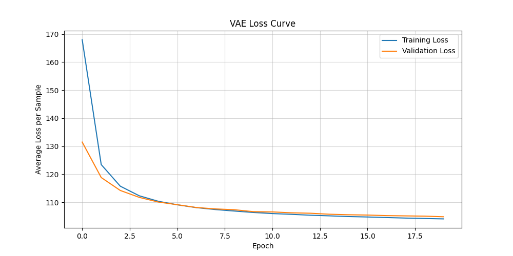
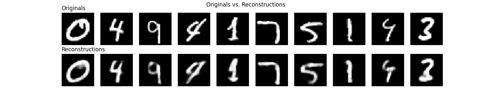
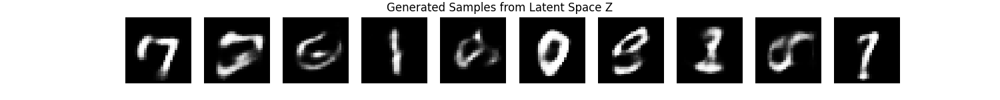
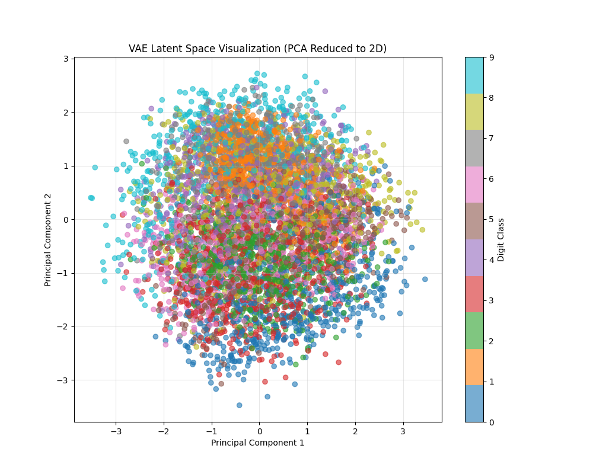

## 1. Data Preparation and Hyperparameters

Before training a Variational Autoencoder (VAE), it is essential to prepare the dataset and define the hyperparameters.

```py
# region Def Hyperparameters
BATCH_SIZE = 128
VALIDATION_SPLIT = 0.1  # 10% of the training data for validation
LATENT_DIM = 20  # Dimension of the latent space (Z)
RANDOM_SEED = 42
LEARNING_RATE = 1e-3
NUM_EPOCHS = 20

INPUT_DIM = 784  # 28 * 28 pixels for MNIST images
HIDDEN_DIM = 392 # Dimension of the intermediate layer
# endregion

# region Def Data Preparation
torch.manual_seed(RANDOM_SEED)
device = torch.device("cuda" if torch.cuda.is_available() else "cpu")
print(f"Using device: {device}")

def prepare_data(batch_size=BATCH_SIZE, val_split=VALIDATION_SPLIT):
    # 1. Define Transformations: Normalize images to [0, 1]
    transform = transforms.ToTensor()

    # 2. Load the Datasets (MNIST)
    train_data = datasets.MNIST(root='./data', train=True, download=True, transform=transform)
    test_data = datasets.MNIST(root='./data', train=False, download=True, transform=transform)

    # 3. Split the Training Dataset into Training and Validation sets
    train_size = len(train_data)
    val_size = int(val_split * train_size)
    train_size -= val_size

    train_subset, val_subset = random_split(
        train_data,
        [train_size, val_size],
        generator=torch.Generator().manual_seed(RANDOM_SEED)
    )

    print(f"Total Training Samples: {len(train_data)}")
    print(f"Final Training Samples: {len(train_subset)}")
    print(f"Validation Samples: {len(val_subset)}")
    print(f"Test Samples: {len(test_data)}")

    # 4. Create DataLoaders (num_workers=0 for stability on Windows)
    train_loader = DataLoader(train_subset, batch_size=batch_size, shuffle=True, num_workers=0, pin_memory=False)
    val_loader = DataLoader(val_subset, batch_size=batch_size, shuffle=False, num_workers=0, pin_memory=False)
    test_loader = DataLoader(test_data, batch_size=batch_size, shuffle=False, num_workers=0, pin_memory=False)

    return train_loader, val_loader, test_loader
# endregion


train_loader, val_loader, test_loader = prepare_data()
```

The dataset consists of 60,000 training images and 10,000 test images from MNIST, representing handwritten digits (0-9). Each image is 28x28 pixels and normalized to the [0, 1] range. The training set is further split into 90% training (54,000 images) and 10% validation (6,000 images) to monitor model performance during training.
The VAE uses a 20-dimensional latent space, which provides sufficient capacity to capture the essential features of handwritten digits while maintaining computational efficiency. The architecture includes a hidden layer of 392 dimensions, creating a bottleneck that forces the model to learn meaningful representations.

## 2. VAE Architecture

The VAE architecture includes an encoder that compresses the input images into a latent space defined by mean and log-variance vectors. The reparameterization trick allows for backpropagation through the stochastic sampling process. The decoder reconstructs the images from the sampled latent vectors, using a sigmoid activation function to ensure output values are in the [0, 1] range, suitable for image data.

```py
# region VAE Implementation
class VAE(nn.Module):
    def __init__(self, input_dim=INPUT_DIM, hidden_dim=HIDDEN_DIM, latent_dim=LATENT_DIM):
        super(VAE, self).__init__()
        
        # --- 1. Encoder Network (q(z|x)) ---
        self.fc1 = nn.Linear(input_dim, hidden_dim)
        self.fc_mean = nn.Linear(hidden_dim, latent_dim)
        self.fc_logvar = nn.Linear(hidden_dim, latent_dim)
        
        # --- 2. Decoder Network (p(x|z)) ---
        self.fc3 = nn.Linear(latent_dim, hidden_dim)
        self.fc4 = nn.Linear(hidden_dim, input_dim)

    def encoder(self, x):
        x = x.view(-1, INPUT_DIM) 
        h = F.relu(self.fc1(x))
        
        mean = self.fc_mean(h)
        log_var = self.fc_logvar(h)
        return mean, log_var

    def reparameterize(self, mean, log_var):
        """ Implements the Reparameterization Trick. """
        std = torch.exp(0.5 * log_var)
        eps = torch.randn_like(std)
        z = mean + std * eps
        return z

    def decoder(self, z):
        h = F.relu(self.fc3(z))
        return torch.sigmoid(self.fc4(h))

    def forward(self, x):
        mean, log_var = self.encoder(x)
        z = self.reparameterize(mean, log_var)
        x_reconstructed = self.decoder(z)
        return x_reconstructed, mean, log_var
# endregion

vae = VAE().to(device)
optimizer = optim.Adam(vae.parameters(), lr=LEARNING_RATE)
```

## 3. Training

The VAE training involves two main parts of the loss function:

1. **Reconstruction Loss**: Measures how well the VAE reconstructs input images using Binary Cross-Entropy (BCE).
2. **KL Divergence**: Regularizes the latent space by forcing it to follow a standard normal distribution.

```py
def vae_loss_function(x_reconstructed, x, mean, log_var):
    """ Calculates the VAE Loss: L = Reconstruction Loss + KL Divergence Loss """
    # 1. Reconstruction Loss: Binary Cross-Entropy (BCE)
    BCE = F.binary_cross_entropy(x_reconstructed, x.view(-1, INPUT_DIM), reduction='sum')

    # 2. KL Divergence Loss
    KL_Divergence = -0.5 * torch.sum(1 + log_var - mean.pow(2) - log_var.exp())

    return BCE + KL_Divergence
```

The training process uses the following function to update the model weights:

```py
def train_vae(vae, optimizer, train_loader, epoch):
    vae.train()
    train_loss = 0
    for data, _ in train_loader:
        data = data.to(device)
        optimizer.zero_grad()
        x_reconstructed, mean, log_var = vae(data)
        loss = vae_loss_function(x_reconstructed, data, mean, log_var)
        loss.backward()
        optimizer.step()
        train_loss += loss.item()

    avg_loss = train_loss / len(train_loader.dataset)
    print(f'====> Epoch: {epoch:2d} Average Training Loss: {avg_loss:.4f}')
    return avg_loss
```

## 4. Evaluation

The model's performance is monitored through an evaluation function that tracks both the validation loss and collects data for visualization:



```py
def evaluate_vae(vae, val_loader, epoch):
    vae.eval()
    val_loss = 0
    all_latents = []
    all_labels = []
    
    with torch.no_grad():
        for data, labels in val_loader:
            data = data.to(device)
            x_reconstructed, mean, log_var = vae(data)
            val_loss += vae_loss_function(x_reconstructed, data, mean, log_var).item()
            
            # Store latent means and labels for visualization
            all_latents.append(mean.cpu().numpy())
            all_labels.append(labels.cpu().numpy())

    avg_val_loss = val_loss / len(val_loader.dataset)
    print(f'====> Validation Epoch: {epoch:2d} Average Validation Loss: {avg_val_loss:.4f}')
    return avg_val_loss, data, x_reconstructed, all_latents, all_labels
```

## 5. Visualization and Generation

The VAE offers three main types of visualizations that help us understand its behavior:

1. **Reconstructions**: Side-by-side comparison of original and reconstructed images



2. **Generated Samples**: New images generated from points in the latent space



3. **Latent Space**: 2D visualization of the latent space using PCA



```py
def visualize_reconstructions(original, reconstructed, num_images=10):
    fig, axes = plt.subplots(2, num_images, figsize=(15, 3))
    
    for i in range(num_images):
        # Original Image
        axes[0, i].imshow(original[i].cpu().numpy().reshape(28, 28), cmap='gray')
        axes[0, i].axis('off')
        
        # Reconstructed Image
        axes[1, i].imshow(reconstructed[i].cpu().numpy().reshape(28, 28), cmap='gray')
        axes[1, i].axis('off')

    axes[0, 0].set_title("Originals", loc='left')
    axes[1, 0].set_title("Reconstructions", loc='left')
    plt.suptitle("Originals vs. Reconstructions")
    plt.savefig('vae_reconstructions.png')

def generate_samples(vae, num_samples=10):
    with torch.no_grad():
        # 1. Sample Z from prior distribution N(0, I)
        z = torch.randn(num_samples, LATENT_DIM).to(device)
        
        # 2. Decode Z
        generated_images = vae.decoder(z).cpu().numpy()
        
        fig, axes = plt.subplots(1, num_samples, figsize=(15, 1.5))
        
        for i in range(num_samples):
            axes[i].imshow(generated_images[i].reshape(28, 28), cmap='gray')
            axes[i].axis('off')

        plt.suptitle("Generated Samples from Latent Space Z")
        plt.savefig('vae_generated_samples.png')
```

## 6. Results and Insights

After training the VAE for 20 epochs on the MNIST dataset, we obtained the following insights:

1. **Reconstruction Quality**:  
    - Reconstructed images maintain the main characteristics of the digits
    - There is a slight blur in the reconstructions, which is expected due to the probabilistic nature of the model
    - The reconstruction loss (BCE) consistently decreases during training

2. **Latent Space**:  
    - The 20-dimensional latent space, when reduced to 2D via PCA, shows distinct clusters for each digit class
    - The partial overlap between clusters indicates that the model learned smooth and continuous representations
    - KL regularization helps prevent overfitting by keeping latent distributions close to the standard normal

3. **Sample Generation**:  
    - Samples generated from the latent space are recognizable as MNIST digits
    - The quality of the samples indicates that the model successfully captured the underlying data distribution
    - Some samples may appear ambiguous between different digits, reflecting the model's uncertainties

4. **Challenges and Learnings**:  
    - Balancing reconstruction loss and KL divergence is crucial
    - A highly compressed latent space (high KL loss) leads to poor reconstructions
    - An under-regularized latent space (low KL loss) impairs sample generation
    - The Adam optimizer with BCE and KL terms proved effective in finding this balance

**Obs**: This page was generated with the help of AI tools.
